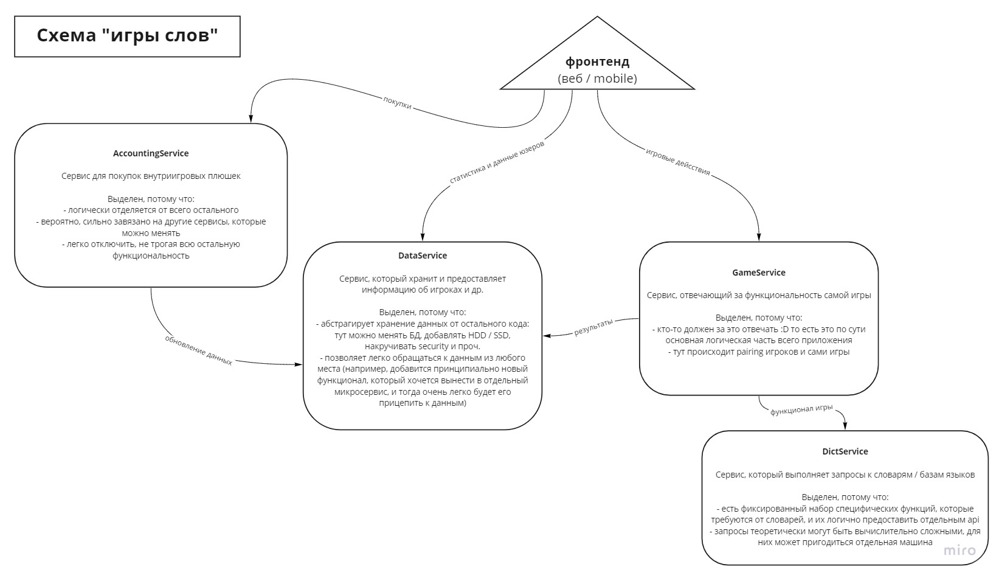

# Осень 2021, курс по бэкенду

Тут происходит проект, который делается в рамках курса.

Схема деления на микросервисы:

Запускаться эти сервера будут пока все на `localhost`, поэтому будут просто на разных путях. 
